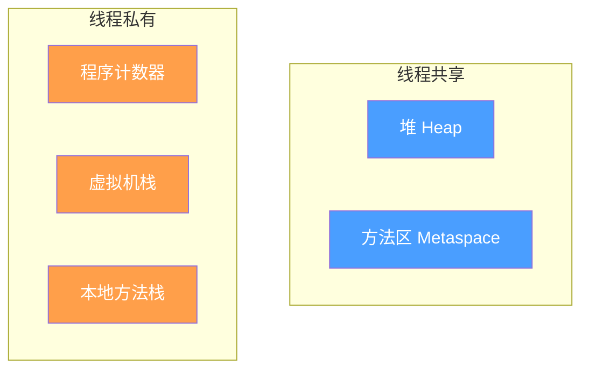
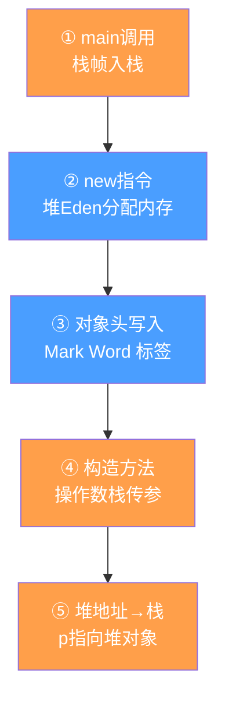
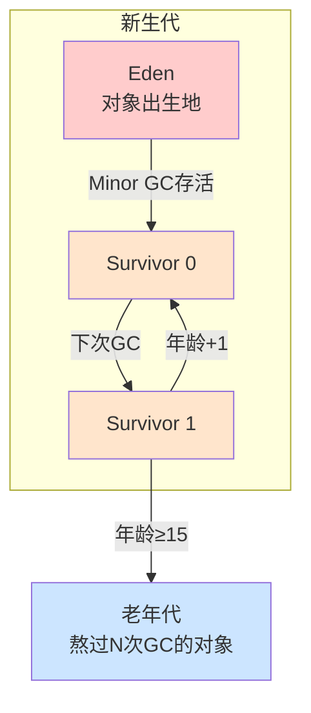

# 1.1 JVM — 我的学习记录

> 路书在 `1-Java核心.md#第三部分：JVM`
> 这是动手实践记录，每个 Session 完成后更新

---

## Session 1：内存区域 + 对象的一生 ⏳

**日期**：2026-06-09
**目标**：能用自己的话说清楚"一个 `new Object()` 从创建到回收经过了哪些内存区域"

---

### 一、JVM 内存布局全景

把 JVM 想象成一台虚拟计算机，它的"内存"就是这台计算机的 RAM。

按**是否被线程共享**分为两类：



#### 逐个拆解：

**① 程序计数器（线程私有）**
- 存当前线程执行到哪一行字节码
- 线程切换后能恢复执行位置
- **唯一不会 OOM 的区域**

**② 虚拟机栈 / Java 栈（线程私有）**
- 每个方法调用→一个栈帧入栈，方法结束→栈帧出栈
- 栈帧里装：局部变量表（int、对象引用等）、操作数栈（计算临时结果）、方法返回地址
- 如果方法递归太深 → **StackOverflowError**

**③ 本地方法栈（线程私有）**
- 跟虚拟机栈一样，但服务于 native 方法（C/C++ 写的底层方法，比如 `System.currentTimeMillis()` 底层调的就是 C）

**④ 堆（线程共享）**
- **对象的家**：所有 `new` 出来的对象都在这
- **堆是一个怎样的模型？** 想象一块巨大的空地，JVM 在上面划区管理：

```
┌─────────────────────────────────────────┐
│                  堆                       │
│  ┌───────┬──────┬──────┬──────────────┐  │
│  │ Eden  │ S0   │ S1   │   老年代      │  │
│  │       │      │      │              │  │
│  │ 对象  │ 存活 │ 存活  │ 熬过N次GC的  │  │
│  │ 出生地 │ 对象 │ 对象  │   老油条     │  │
│  └───────┴──────┴──────┴──────────────┘  │
│                  新生代                    │
└─────────────────────────────────────────┘
```

堆不是一块连续的铁板，它是**按对象的年龄分区管理**的：
- **Eden**（伊甸园）：对象刚出生都在这里，像流水线入口
- **Survivor 0 / 1**（存活区）：从 GC 手里活下来的对象搬到这里，两个区互相交换
- **老年代**：熬过了十几轮 GC 还没死的老对象挪到这里

> 这种分代模型是因为 98% 的对象很快会死。如果把整个堆当一块管，每次 GC 要扫描全部 → 太慢。分代 = 把老人和小孩分开管理，效率高得多。

- **GC 主要工作区域**
- 最常见 OOM 来源：`java.lang.OutOfMemoryError: Java heap space`（堆满了又没东西可回收）

**⑤ 方法区 / 元空间（线程共享）**
- 存类信息（类名、方法字节码、字段信息）、静态变量、常量池
- Java 8 之前叫"永久代"（在堆里），Java 8 改成"元空间"（在本地内存里）
- 为什么要改？永久代大小固定，容易 OOM；元空间用本地内存，只受操作系统限制

---

### 二、new 一个对象，它经历了什么？

```java
Person p = new Person();
```

一步步拆：



#### 展开讲 ③：Mark Word 是什么？

每个对象在堆里不只有业务数据，JVM 还给它贴了个"标签"：

**Mark Word（8字节）** = 多功能瑞士军刀，不同状态下存不同信息：
- 无锁时：哈希码 + GC 年龄
- 有锁时：线程 ID / 锁指针

**Klass Pointer（4/8字节）** → 指向 Person 类的定义位置

> Mark Word = 快递盒上的**物流标签**：写着发件地、目的地、是否运输中。不同运输阶段标签内容不同，但始终是那 8 个字节。

#### 展开讲 ④：操作数栈是什么？

操作数栈就是 JVM 的**草稿纸**——所有计算、传参、返回值都要经过它。

`new Person("张三", 25)` 实际在操作数栈上：

```
① 压入 "张三"     →  [ "张三" ]
② 压入 25         →  [ "张三", 25 ]
③ 调用构造方法    →  弹出 25 和 "张三"
④ 初始化字段
⑤ 堆地址压回栈    →  [地址]
⑥ 弹出 → 存到 p
```

> 操作数栈 = 你算账时手边的**计算器**，按一个数字放进去，再按一个，最后按等号组合出结果。

**关键理解：**
- `p`（引用）在**栈**里
- `new Person()`（对象本体）在**堆**里
- 方法结束 → 栈帧弹出 → `p` 消失 → 堆里的对象没人引用了 → 变成"垃圾" → 等 GC 来收

这就是"**栈管运行，堆管存储**"。

#### 追问：为什么 `ArrayList` 必须在堆里？

因为**它活多久不由方法决定**：

```java
public List<String> createList() {
    List<String> list = new ArrayList<>();  // 引用在栈，对象在堆
    list.add("hello");
    return list;  // list 要返回给调用者！
}
// createList 结束 → 栈帧弹出 → list 引用消失
// 但堆里的 ArrayList 还在，因为有调用者引用它
```

如果 `new ArrayList<>()` 分配在栈上，方法结束栈帧弹出，ArrayList 跟着销毁，调用者拿到空指针。

**规则：所有 `new` 出来的东西都在堆里。** 理由很简单：
- 栈上数据随方法结束自动销毁
- 堆上数据可以跨方法存活（只要有人引用它）
- 对象生死由 GC 决定，不需要程序员操心

> 有一个例外：**逃逸分析**。如果 JVM 确定对象没逃出方法（不返回、不赋值给静态变量、不被其他线程访问），它会优化到栈上分配，省掉 GC 开销。但这只是 JVM 的优化，不是语言规范。

---

### 三、为什么堆要分代？为什么有新生代、老年代？

**因为 98% 的对象朝生夕死。**

如果不分代，每次 GC 都要扫描全堆 → 太慢。
分代后：


- **新生代**：专门对付"活不过一次 GC"的短命对象（大部分对象都在 Eden 出生后很快死去）
- **老年代**：存放熬过了多次 GC 的"老油条"对象

打个比方：
> 新生代是**急诊室** — 大部分患者（对象）进来就出去了。  
> 老年代是**住院部** — 只有病情稳定的才留在这。  
> 每次 GC 只查急诊室就很高效，不用查整个医院。

**对象晋升老年代的条件：**
1. 熬过了 N 次 Minor GC（默认 N=15，每次 GC 存活下来年龄 +1）
2. 大对象直接进入老年代（`-XX:PretenureSizeThreshold`）

---

### 四、动手验证

#### 1. 查看本机 JVM 默认堆大小

```powershell
java -XX:+PrintFlagsFinal -version | findstr HeapSize
```

把输出填这里：
```
InitialHeapSize = 232783872  ← 约 222MB
MaxHeapSize     = 3720347648 ← 约 3.5GB
```

**这些值怎么来的？**

```
你的物理内存：16 GB（16 × 1024 × 1024 × 1024 = 17,179,869,184 字节）

InitialHeapSize = 17,179,869,184 ÷ 64 ≈ 268MB ... 但是 JVM 有一个下限阈值，
                 实际取的是"1/64 和 某个最小值之间取较大值"，你的机器实际得到 ~222MB

MaxHeapSize     = 17,179,869,184 ÷ 4  ≈ 4.3GB ... 实际得到 ~3.5GB
```

JVM 的规则：
- **初始堆** ≈ 物理内存 / 64（但不超过 1GB，不低于 5MB）
- **最大堆** ≈ 物理内存 / 4（但不超过 25GB，不低于 16MB）
- 这两个值可以通过 `-Xms` 和 `-Xmx` 覆盖

为什么要这么设计？
- 初始堆设小一点：**启动快**（不用一次性申请大块内存）
- 最大堆设个上限：**防止 Java 吃完所有内存**，给操作系统和其他程序留空间

**为什么是 1/64 和 1/4？**

经验值，不是数学推导。

| 参数 | 比例 | 逻辑 |
|------|------|------|
| 初始堆 1/64 | ≈1.5% | 先少拿点，不够再扩容。大部分 Java 程序启动时用不了多少内存 |
| 最大堆 1/4 | 25% | 最多拿四分之一，别把家底吃光。给操作系统文件缓存、其他进程留空间 |

如果最大堆设太大（比如 100%），当 Java Full GC 时内存暴增，系统会用硬盘当内存（Swap），直接卡死。1/4 是个"不会因为 Java 而把机器搞崩"的安全上限。

**对你实际的影响：**
- 一个 JVM 程序最多吃 3.5GB（你的 16GB 内存 × 1/4）
- 如果同时跑多个 Java 程序（比如 IDE + 后端服务 + 本地数据库），总和可能超过 16GB → 系统变慢
- 这时需要手动 `-Xmx` 给每个程序分配更小的上限

> 注意：这个值取决于你电脑内存。JVM 默认初始堆 ≈ 物理内存的 1/64，最大堆 ≈ 1/4。

#### 2. 跑这段代码，逐行对应内存区域

`JvmMemoryDemo.java`（写进笔记，不用切文件）：

```java
public class JvmMemoryDemo {

    // ====== 方法区（元空间）======
    // 类的信息、静态变量存在这
    private static String staticField = "静态变量 → 方法区";
    private static final int CONSTANT = 42;

    // ====== 堆 ======
    // 实例变量存在堆里的对象中
    private String instanceField;

    public JvmMemoryDemo(String value) {
        this.instanceField = value;
    }

    public static void main(String[] args) throws Exception {

        // ====== ① 程序计数器 ======
        // 看不见摸不着，JVM 内部记"执行到第几行字节码"
        // 线程切换时靠它恢复位置

        // ====== ② 虚拟机栈（Java 栈）====== 
        // main 方法调用 → 一个栈帧入栈
        // 栈帧里装着：局部变量表、操作数栈、返回地址

        System.out.println("=== Step 1: 局部变量都在栈里 ===");
        int x = 10;           // x 存在 main 栈帧的局部变量表
        int y = 20;           // y 也在栈里
        int sum = x + y;      // 计算在操作数栈里完成
        System.out.println("x + y = " + sum);
        System.in.read();     // 按回车继续

        // ====== ③ 堆 ======
        System.out.println("=== Step 2: new → 对象在堆 ===");
        // obj 引用 → 存栈里；new JvmMemoryDemo → 存堆里
        JvmMemoryDemo obj = new JvmMemoryDemo("hello");
        obj.doSomething();

        System.out.println("=== Step 3: 堆分配 50MB ===");
        java.util.ArrayList<byte[]> list = new java.util.ArrayList<>();
        for (int i = 0; i < 50; i++) {
            list.add(new byte[1024 * 1024]); // 堆里分配 1MB
            System.out.println("已分配 " + (i + 1) + " MB");
            Thread.sleep(100);
        }

        System.out.println("按回车释放...");
        System.in.read();

        // ====== ④ 对象变垃圾 ======
        list = null;  // 没人引用了 → 变成垃圾
        System.out.println("list=null, 等GC...");
        Thread.sleep(2000);
        System.gc();  // 建议 GC
        Thread.sleep(3000);
        System.out.println("GC 完成, 堆应该降了");

        // ====== ⑤ main结束 → 栈帧弹出 ======
        // 栈上引用消失, 堆对象彻底无人指向
    }

    public void doSomething() {
        // ====== ② 虚拟机栈：doSomething 的栈帧 ======
        String localVar = "局部变量 → doSomething 栈帧";
        System.out.println(localVar + "\n方法结束 → 栈帧弹出");
    }
}
```

跑起来：
```powershell
cd Backend\基础知识
javac JvmMemoryDemo.java
java JvmMemoryDemo
```

每步按回车，看输出。另外再试试调堆参数跑：
```powershell
java -Xms32m -Xmx128m JvmMemoryDemo
```

---

### 四（续）、用 jvisualvm 肉眼观察

JDK 自带 `jvisualvm`（在 JDK bin 目录下），启动后能看到：
- 堆曲线：分配 50MB 时直线上升，GC 后下降
- 线程栈：main 线程的调用栈

```powershell
jvisualvm
```

---

### 五、检验理解

看完上面这些，试试用自己的话回答：

1. 一个 `new Object()` 存在哪个区域？
2. 方法里的局部变量存在哪？
3. 静态变量存在哪？
4. 为什么堆不分代会很慢？
5. Java 8 为什么把永久代改成元空间？
6. 递归调用太深会报什么错？为什么？

---

**我的理解（用自己的话写在这里，后面复习看）：**

**疑问/待深入：**

---

## Session 2：垃圾回收基础

## Session 3：GC 实战对比

## Session 4：类加载机制

## Session 5：调优 + 综合实战
